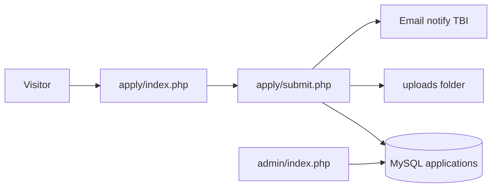

# Convert PDF application to a hosted web form

Replace the PDF application link with a hosted web form that captures the same incubatee fields, stores submissions in MySQL, and deploys on shared hosting (Hostinger or A2) using PHP.

## Todos

- Add MySQL schema for applications, education, costs, references, files
- Build apply/index.php form matching PDF fields + brand CSS
- Implement apply/submit.php: CSRF, validation, PDO insert, uploads, notify email
- Add password-protected admin list/detail for submissions
- Point index.html Fill application to the new form; keep PDF as optional download
- Add config.sample.php, .htaccess, and Hostinger/A2 deploy notes

## Hosting reality (Hostinger / A2)

Both Hostinger and A2 Hosting shared plans run **PHP + MySQL** (cPanel or hPanel). They do **not** run Node/Python backends well on cheap shared plans.

Use:

- Static HTML/CSS/JS for the public site (unchanged)
- **PHP** to receive the form (`apply/submit.php`)
- **MySQL** to store applications
- Optional PHP mail() / SMTP to email TBI when someone applies

Do **not** use Google Forms if the requirement is “hosted on Hostinger/A2 with a database.” Google Forms live on Google, not your hosting.

Skip collecting **PAN / Aadhaar** on the web form. Those are not fields on the PDF; the current page already warns against sending IDs unofficially. Keep ID proof as an in-person / official-channel step.

Skip the PDF’s **“For office use only”** page (cubicle charges, PSO). That is staff, not applicant.

## What applicants fill (from assets/docs/application-form.pdf)

**Applicant**

- Entrepreneur name, age, date of birth
- Communication address, permanent address
- Phone (res / office / mobile), email
- Education rows: class/course, college, branch, university/board, year of pass, % secured
- Innovative skills & experience
- Type of business, organization name

**Venture**

- Product / business description (textarea; optional file upload)
- Startup year
- Why become an entrepreneur
- Legal position: Proprietorship / Partnership / Corporation / Private
- Services expected (checkboxes: workspace, shared office, equipment, management, business planning, finance, technical, networking, branding, patenting, mentoring, R&D)
- Team details; resident employees (full-time / part-time / consultants); org headcount
- Promoter: name, qualification, designation, years of experience, addresses, phones, email, fax
- Estimated project cost (repeatable cost / amount rows)
- Two references: name, designation, address, phone, email
- Place + declaration (date set server-side)
- Checkbox: agree to TBI rules (pages 6–7 of the PDF, shown as a collapsible summary on the form)

**Uploads (optional, size-capped)**

- Promoter photograph
- Extra product write-up (PDF/DOC)

## App shape

```
index.html                 # change CTA to apply/index.php
apply/index.php            # form UI (same brand CSS)
apply/submit.php           # validate, save, redirect
apply/success.html
admin/index.php            # password-protected list + detail
config.php                 # DB credentials (not committed; sample as config.sample.php)
sql/schema.sql
uploads/                   # outside public listing; PHP-gated
```

**Flow**



## Database (one application row + child tables)

- `applications` — main fields + `created_at`, `ip`, `agreed_rules`
- `education` — N rows per application
- `project_costs` — N rows
- `references` — two rows
- `files` — filename, mime, stored path

PHP PDO, prepared statements, CSRF token, honeypot field, server-side required checks, file type/size limits (e.g. 2 MB photo, 5 MB PDF).

Admin: HTTP basic auth or a simple session password in `config.php`. List submissions; view one application; download uploads. No public listing of uploads.

## Site change

In `index.html`, replace “Open application info” with **Fill application** → `apply/index.php`. Keep the PDF as “Download blank form (PDF)” for people who still want paper.

Update the documents note so PAN/Aadhaar stay offline.

## Deploy on Hostinger / A2

1. Create MySQL database + user in hPanel/cPanel.
2. Import `sql/schema.sql`.
3. Upload the site (FTP/File Manager) to `public_html` (or a subdomain like `tbi.ksrf.in`).
4. Copy `config.sample.php` → `config.php` with DB host (`localhost`), name, user, password, admin password, notify email.
5. `uploads/` and `config.php` not world-readable; `uploads` blocked from direct URL via `.htaccess`.
6. Enable HTTPS (Let’s Encrypt in the panel).
7. PHP 8.x; `upload_max_filesize` high enough for the two files.

Shared hosting has no always-on Node process. PHP + MySQL is the correct match.

## Security notes

- Do not store Aadhaar/PAN.
- Sanitize output in admin (`htmlspecialchars`).
- Rate-limit submissions (simple IP + time check in MySQL).
- Keep `config.php` out of git.
